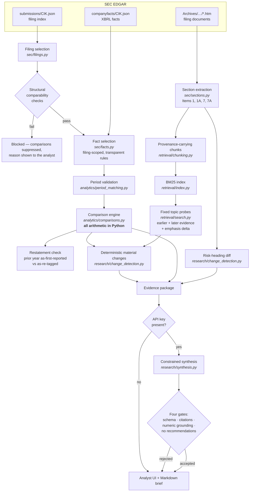

# Evidence-First Filing Change Analyst

**What materially changed in this company's latest SEC filing versus the previous comparable one — and what evidence supports every conclusion?**

A working prototype for a fundamental equity team. It compares two consecutive SEC filings, calculates
every financial change in Python, retrieves matched earlier/later evidence for each claimed change, and
produces a citation-backed analyst brief that visibly separates verified facts from model interpretation.

> Research aid, not investment advice. No recommendations, no price targets, no predictions.

---

## The problem

During earnings season a fundamental analyst repeats the same manual loop for company after company:
find the latest and previous comparable filings, read hundreds of pages, reconcile the numbers, notice
what changed in management's language and risk disclosures, then verify every conclusion against the
source before it can be used in an investment discussion.

It is slow, it is repetitive, and it is exactly where things get missed. A generic LLM summary makes it
worse: it produces fluent prose with unverifiable numbers, which an analyst then has to re-check line by
line — no time saved, and new risk introduced.

**Target user:** a fundamental equity analyst doing first-pass review of a 10-K.
**What this does:** compresses the mechanical part of that first pass while keeping the analyst in control
of every judgement.

---

## What it produces

The default action always compares a company's **two most recent comparable filings**. Microsoft filed
its FY2026 10-K on 2026-07-30, during this build — so the live default is now FY2026 vs FY2025, and the
system picked the new filing up with **no code change**:

| | FY2026 vs FY2025 (live default) | FY2025 vs FY2024 (pinned example) |
|---|---|---|
| Financial metrics compared | **21 / 21** | **21 / 21** |
| Evidence chunks indexed | 449 | 471 |
| Material changes surfaced | 8 | 7 |
| Risk-factor headings | 31 → 33 (+4 / −2) | 34 → 31 (+2 / −5) |
| Revenue | $281.72B → $331.84B (**+17.79%**) | $245.12B → $281.72B (+14.93%) |
| Capital expenditure | $64.55B → $115.95B (**+79.62%**) | $44.48B → $64.55B (+45.13%) |
| Estimated free cash flow | $71.61B → $66.99B (**−6.46%**) | $74.07B → $71.61B (−3.32%) |
| Run time, warm cache | ~5 s | ~4.5 s |
| Works with no API key | **Yes** | **Yes** |

The FY2025/FY2024 pair is the *pinned* example: the evaluation ground truth was read by hand from those
two documents, and the screenshots below were captured on that pair. Pinning by accession number is
deliberate — otherwise a newly filed 10-K silently invalidates every expected value in the suite.

A representative finding from the pinned run, produced with no model involved:

> **Reported figures and narrative emphasis diverge on AI investment and monetisation:**
> capital expenditure changed **+45.1%** ($44.48B → $64.55B), while narrative emphasis
> **decreased** (−11.4 mentions per 10,000 tokens).
>
> *Earlier evidence:* FY2024 10-K, Item 1A — Risk Factors, accession `0000950170-24-087843` …
> *Later evidence:* FY2025 10-K, Item 1A — Risk Factors, accession `0000950170-25-100235` …
>
> ⚠️ *Caveat:* Emphasis is a phrase-frequency measure normalised per 10,000 tokens — a prominence
> signal, not a semantic judgement. A divergence may reflect reorganised disclosure rather than a
> change in management's priorities.

That is the kind of thing an analyst wants surfaced: capex up 45% while free cash flow *fell* 3.3%, and
`Copilot` mentions down from 29 to 9 between the two filings. Both are checkable in one click.

On the newest pair the same machinery reads the story differently, and correctly — AI emphasis and capex
now move *together*: "narrative emphasis on AI investment and monetisation increased (+55.5 mentions per
10,000 tokens) and the linked reported figures moved in the same direction."

Full generated briefs for both pairs are committed in [`data/sample/`](data/sample/):
[FY2026](data/sample/MSFT_10-K_2026-06-30_change_brief.md) ·
[FY2025](data/sample/MSFT_10-K_2025-06-30_change_brief.md).

## Screenshots

All captured from a live run with **no API key configured**, on the pinned FY2025/FY2024 pair. Full
index in [`docs/screenshots/`](docs/screenshots/README.md).

**The financial snapshot — every figure calculated in Python, with the capex/FCF divergence visible**


**A material change, with earlier and later evidence side by side and full SEC provenance on both**


**Honest refusal — the system declines and shows the measured signals behind the decision**


**Item 1A risk-factor heading diff**


---

## Quick start

Requires Python 3.11+.

```bash
git clone <this repo> && cd evidence-first-filing-change-analyst

python -m venv .venv && source .venv/bin/activate     # or: uv venv && source .venv/bin/activate
pip install -e ".[dev]"                               # or: uv pip install -e ".[dev]"

cp .env.example .env
# Edit .env and set SEC_USER_AGENT to a real "Your Name your@email" value.
# SEC blocks unidentified automated clients. ANTHROPIC_API_KEY is optional.

streamlit run app.py
```

Then press **Compare latest filings**. The default is MSFT 10-K year-over-year.

```bash
pytest                              # 131 tests, fully offline, ~1.4s
ruff check src tests app.py         # lint
python evaluation/run_evaluation.py # 22 questions against the pinned MSFT FY2025/FY2024 pair
python evaluation/run_evaluation.py --latest-pair   # score against today's latest pair instead
```

### Running without an LLM

Leave `ANTHROPIC_API_KEY` empty. The app states plainly that AI synthesis is disabled and still gives you:

* the full 21-metric comparison with per-fact provenance,
* the risk-factor heading diff,
* all ten topic probes with measured emphasis deltas,
* the material-change list with earlier/later evidence,
* filing search with cited excerpts,
* the downloadable Markdown brief.

Only the interpretive sections (executive summary, bull/bear, questions for management) are omitted, and
the brief says so where they would have been.

---

## Architecture



Full walkthrough in [`docs/architecture.md`](docs/architecture.md).

### The three decisions that define this system

**1. Python computes; the model interprets.**
Every displayed figure originates in `analytics/comparisons.py` from XBRL facts with recorded provenance.
The model receives those values pre-computed, is instructed to reference them by `metric_id` and never to
write a figure, and is then *mechanically checked*: `analytics/validation.py` extracts every numeric
literal from the generated prose and rejects any that does not appear in the supplied evidence or the
computed metric table. A claim containing an invented number is discarded, not displayed with a warning.

**2. Change detection is deterministic, so the product works without a model.**
Each of ten research topics is a fixed, versioned query. The system retrieves matched earlier and later
evidence for it and measures a normalised **emphasis delta** — non-overlapping phrase occurrences per
10,000 tokens — alongside the linked metric moves. Material changes are ranked and emitted from those two
measurements. The model, when present, *interprets* them; it cannot create a change out of nothing, and
its output is layered on a result that is already complete and displayable.

**3. Period correctness is a gate, not a footnote.**
Comparing a quarter with a year is the most damaging error this class of tool can make, so structural
checks (`sec/filings.py`) run before any arithmetic, and fact-level checks (`analytics/period_matching.py`)
run per metric. Instant facts never meet duration facts; a 45-day duration mismatch blocks the comparison;
a two-year gap is refused. A blocked comparison shows `N/A` with the reason, and the brief carries a
blocking banner.

---

## Evidence and provenance

Every excerpt carries company, ticker, CIK, form, filing date, reporting period, accession number, section
name, chunk id and a link to the original document on SEC EDGAR. **Page numbers are never fabricated** —
10-K HTML has no stable pagination, so anchoring is by section plus accession.

Every metric value carries the XBRL concept, taxonomy, unit, period start/end, duration class, source form,
accession, filing date and the *selection rule* that chose it. Fact selection is filing-scoped by default:
the value shown for a filing is the value tagged *in that filing*, so the year-over-year comparison is the
one an analyst would read off the two documents.

The comparison also runs a **restatement check** — the prior year as first reported against the same period
as re-tagged in the newer filing — because a silent reclassification makes a naive YoY change wrong.

---

## Six claim types, always visibly labelled

| Label | Meaning |
|---|---|
| ✅ **Verified fact** | Directly reported in a filing |
| 🧮 **Calculated change** | Computed in Python from verified values |
| 💬 **Management statement** | Attributed commentary from a filing |
| 🤖 **AI interpretation** | A reasoned but non-authoritative inference |
| ⚠️ **Caveat** | A limitation or ambiguity — attached to *every* material change |
| ❓ **Open question** | Something the evidence does not establish |

Bull and bear sections are labelled "interpretation, not a recommendation" in both the UI and the brief.

---

## Evaluation results

22 questions against the live MSFT FY2025/FY2024 pair. Ground truth was read by hand from the two filings;
percentage expectations were computed by hand, not copied from the tool's output.
Run with `python evaluation/run_evaluation.py`; the full report regenerates into
[`evaluation/RESULTS.md`](evaluation/RESULTS.md).

**Deterministic-only configuration (no API key) — 21/21 scored questions passed, 3 not measured:**

| Measure | Result |
|---|---|
| Metric correctness — calculated values match hand-read filing values | 11/11 (100%) |
| Period correctness — compared facts use compatible durations/instants | 2/2 (100%) |
| Retrieval success — expected section and evidence retrieved | 7/7 (100%) |
| Citation validity — every citation resolves to supplied evidence | 11/11 (100%) |
| Citation support — retrieved excerpt contains the expected terminology | 4/4 (100%) |
| Numerical accuracy — reported changes reproduce deterministic values | 4/4 (100%) |
| Insufficient-evidence handling — the system declines | 3/3 (100%) |
| Unsupported-claim rate — material changes lacking both-period evidence or a caveat | 0/7 |
| Latency — full pipeline, warm cache | 4.2 s |

The three unmeasured questions are **fact-level gaps** — the words are all present in the filings but the
fact is not disclosed ("what percentage of capex was attributable to AI?"). A lexical retriever cannot
detect those; they need a model, and are reported as *not measured* rather than scored as passes.

**How the decline gate was built (a real finding from this evaluation).** The first version used a BM25
score threshold and failed two questions: an off-topic control scored 14.5, higher than several genuine
questions. Measured over 16 answerable and 6 unanswerable questions, neither BM25 score (ranges 5.8–34.4
vs 5.6–14.5) nor raw query coverage (0.41–1.00 vs 0.17–0.67) separates the classes. What worked was
**query coverage over content terms only** — dropping question words like "describe" and "drove", which no
filing contains and which made well-phrased questions look unanswerable. That separates cleanly
(0.76–1.00 vs 0.11–0.67). The reasoning, the measured table and the ~8% margin are recorded in
`research/qa.py` next to the constants.

---

## Testing

131 tests, all offline, ~1.4 s. Fixtures are trimmed real SEC captures (submissions and companyfacts for
CIK 0000789019) plus two synthetic miniature 10-Ks. No test touches the network or needs an API key.

| Area | Covers |
|---|---|
| `test_period_matching.py` | duration classes, instant vs duration, unit mismatch, fiscal drift, 52/53-week calendars, form mismatch, amendments |
| `test_metrics.py` | values vs the filing, percent vs percentage-point changes, derived metrics, gross-profit fallback, missing data, zero denominators, sign flips, provenance completeness |
| `test_sections_and_retrieval.py` | item extraction vs table-of-contents traps, section bleed, risk headings, chunk provenance and stability, BM25 filters, phrase-frequency overlap, metric-reuse cap |
| `test_citations.py` | accession validation, EDGAR URL construction, fabricated-id rejection, both-period requirement, no page numbers |
| `test_llm_guardrails.py` | schema validation, numeric grounding, recommendation detection, prompt-injection redaction, stubbed-model gates, failure/refusal handling, key never logged |
| `test_qa_gating.py` | content-term extraction, decline gate on both signals, risk-question routing, no-LLM behaviour |
| `test_end_to_end.py` | full pipeline offline, brief structure and provenance, reproducibility, incompatible pairs, a simulated SEC outage |

---

## Security and reliability

* Secrets and SEC identity come from the environment; `.env` is gitignored and nothing sensitive is
  defaulted into source. The API key is never written to a log or run record (there is a test for it).
* SEC calls are identified, throttled below the fair-access ceiling, given a 30-second timeout and bounded
  retries with exponential backoff, and fall back to a stale cache entry rather than failing the demo.
* Filing HTML is stripped to text on ingest and never re-rendered as markup.
* Filing text and user questions pass through an injection-marker redactor before entering any prompt, and
  evidence is wrapped in delimited blocks with an explicit untrusted-data notice.
* Structured model output is validated by Pydantic, then by citation, numeric-grounding and
  recommendation gates. A failure at any gate discards the model's contribution and keeps the
  deterministic result.
* Every model call is logged with model id, prompt version, latency, token counts, dropped citations and
  dropped changes — visible in the UI and appended to the brief.
* A missing filing document degrades to "text evidence unavailable for that period" while the financial
  comparison completes (there is a test for this).

---

## Trade-offs

| Decision | Why | What it costs |
|---|---|---|
| Hand-rolled SEC client instead of EdgarTools | Needs the `accn` field on every XBRL fact — that is what makes provenance auditable — plus exact control of caching and offline mode | More code to maintain |
| BM25 instead of embeddings | Filing questions turn on exact terminology; reproducible, no model download, runs offline | Weak paraphrase recall, mitigated by hand-written query expansions |
| XBRL facts instead of parsing statement tables | Units, periods and provenance come for free and are machine-checkable | An untagged concept shows `N/A` instead of being recovered from the HTML table |
| Fixed topic probes instead of open-ended LLM discovery | Reproducible, works with no key, and the model cannot invent a change | Only finds changes in the ten catalogued themes |
| Deterministic layer first, model second | A slow or failing model degrades the product instead of breaking it | Two passes over the evidence |
| Heading-level risk diff | Reliable signal filers actually mark up in bold | A risk whose heading is unchanged but whose body was rewritten is missed |
| Streamlit | Fastest path to an analyst-usable interface | Not a production front end |

---

## Limitations

Honest and specific. Full list with mitigations in [`docs/limitations.md`](docs/limitations.md).

1. **Deterministic decline detects vocabulary gaps, not fact gaps.** "What was the closing share price?"
   uses words that all appear in the filings, so the lexical gate cannot tell the fact is absent. Without
   a model, that question returns evidence rather than a refusal. Measured, and kept in the evaluation
   suite as `q20`/`q21`/`q22`.
2. **Decline thresholds are calibrated on one filing pair** with ~8% margin. They are a genuine tuning
   risk on companies with different vocabulary.
3. **Emphasis delta measures prominence, not meaning.** It cannot distinguish "we invested more in AI"
   from "AI is a risk to us", and it moves when a filing is reorganised. Every change that uses it carries
   this caveat.
4. **Only Items 1, 1A, 7 and 7A are extracted.** Financial-statement notes, segment tables, exhibits and
   Item 5 market information are not searchable.
5. **Section extraction relies on filers rendering item headings in upper case.** It works on the MSFT
   filings tested and reports low confidence rather than guessing when it fails, but it has not been
   validated across a broad sample of filers.
6. **Free cash flow is a prototype definition** (operating cash flow − purchases of PP&E). It excludes
   acquisitions, finance-lease principal and capitalised software, so it will not match a company's own
   FCF disclosure. The definition is printed next to the number.
7. **Ticker generality is untested beyond MSFT.** Other tickers run, but the metric concept fallbacks and
   the section anchors are only validated on one filer. (Validated across three MSFT filing years,
   including a 10-K filed on the day of the build with no code change — but that is still one filer.)
8. **10-Q support is structural only.** The comparability checks handle it; the metric catalogue and topic
   probes are tuned for annual filings.
9. **This is a prototype.** Not institutional-grade, not production-ready, and it does not eliminate
   hallucination — it constrains, checks and labels model output, and reports what it could not verify.

---

## Next steps

* Extend the deterministic decline gate with a claim-level entailment check so fact-level gaps are caught
  without a model.
* Validate section extraction across 50+ filers and add a fallback anchoring strategy.
* Add segment-level metrics from XBRL dimensional facts — the single most-requested thing missing from
  the capex story.
* Sentence-level risk-body diffing to catch material rewrites under unchanged headings.
* Batch mode: run a watchlist overnight and surface only the pairs whose signals cross thresholds.

---

## Repository layout

```
app.py                              Streamlit interface (Views A–E)
src/filing_change_analyst/
  config.py  models.py  formatting.py  pipeline.py
  sec/        client.py filings.py facts.py sections.py
  analytics/  metric_definitions.py period_matching.py comparisons.py validation.py
  retrieval/  chunking.py index.py search.py citations.py
  research/   prompts.py change_detection.py synthesis.py qa.py brief.py
  services/   cache.py llm.py
  ui/         components.py
tests/                              131 offline tests + fixtures
evaluation/                         questions.json, run_evaluation.py, RESULTS.md
docs/                               architecture, limitations, interview demo, screenshots
data/sample/                        committed sample analyst brief
```

## Assumptions recorded during the build

* Microsoft is the default company, as suggested in the brief. Microsoft filed its FY2026 10-K
  (`0001193125-26-323660`) during the build, so the live default pair moved from FY2025/FY2024 to
  FY2026/FY2025 mid-session. The evaluation is pinned by accession to FY2025 (`0000950170-25-100235`)
  vs FY2024 (`0000950170-24-087843`) so its hand-read ground truth stays valid; `--latest-pair`
  overrides that.
* "Comparable" for a 10-K means period ends 10–14 months apart; for a 10-Q it means the same quarter of
  the prior year. Anything else is refused rather than warned about.
* Metrics are read from XBRL rather than the statement HTML; a metric with no usable tag is `N/A`.
* Materiality thresholds: 15% for level metrics, 1.0 percentage point for ratios, 1.5 mentions per 10,000
  tokens for emphasis. One metric may anchor at most two claims, so a single headline number cannot be
  recycled into an apparently long change list.
* The change list is capped at 8 and is allowed to be short. Nothing is padded.

## License

MIT — see [`LICENSE`](LICENSE).
