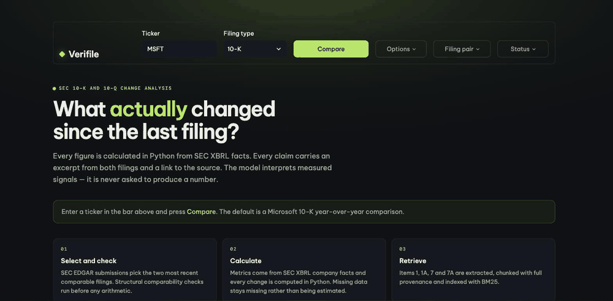

# Verifile

[](https://verifile.streamlit.app)
[](LICENSE)
[](pyproject.toml)
[](tests/)
[](#running-without-a-model)

**What materially changed in this company's latest SEC filing versus the previous comparable one — and what evidence supports every conclusion?**

Verifile compares two consecutive SEC filings, calculates every financial change in Python, retrieves
matched earlier/later evidence for each claimed change, and produces a citation-backed analyst brief that
visibly separates verified fact from model interpretation.

> Research aid, not investment advice. No recommendations, no price targets, no predictions.



**[verifile.streamlit.app](https://verifile.streamlit.app)** — no signup, no key, nothing to install.
`MSFT`, `AAPL`, `NVDA` and `PG` are pre-warmed and return in a few seconds; any other US filer with a
10-K is fetched live from EDGAR.

---

## Why it exists

An analyst comparing two 10-Ks is doing three tedious things at once: finding which numbers moved,
finding which language moved, and remembering which is which. Tools that hand this to a language model
produce fluent summaries whose numbers cannot be checked and whose claims cannot be traced.

Verifile inverts that. The model never sees a calculator and is never asked for a figure.

| Layer | Who does it | Guarantee |
|---|---|---|
| Financial change | Python, from SEC XBRL facts | Every figure reproducible; missing data stays `N/A`, never estimated |
| Textual change | Fixed, versioned topic probes + BM25 | The same filing pair always yields the same evidence |
| Interpretation | The model, optional | Schema-constrained, citation-checked, numerically grounded, no recommendations |

Three design decisions follow from that split:

1. **Comparability is checked before arithmetic.** Period ends 10–14 months apart for a 10-K, the same
   quarter a year prior for a 10-Q. Anything else is refused, not warned about.
2. **Every change cites both periods.** A claim with evidence from only one filing is not a change.
3. **The seams are on screen.** Extraction confidence, restatement flags and blocked metrics are shown,
   not hidden — including when they make the tool look worse.

## Quick start

Requires Python 3.11+.

```bash
git clone https://github.com/yaoDu/verifile.git && cd verifile

python -m venv .venv && source .venv/bin/activate
pip install -e ".[dev]"

cp .env.example .env
# Set SEC_USER_AGENT to a real "Your Name your@email" value — SEC blocks
# unidentified automated clients. API_KEY is optional.

streamlit run app.py
```

```bash
pytest                                     # 168 tests, fully offline, ~2s
ruff check src tests app.py                # lint
python evaluation/run_evaluation.py        # 22 questions vs the pinned MSFT FY2025/FY2024 pair
python evaluation/run_coverage_check.py    # 11-filer sweep -> evaluation/COVERAGE.md
```

## Running without a model

The hosted instance runs with **no API key**, which is the honest default: every number, every citation
and the entire material-change list on that deployment are produced deterministically in Python.

Setting `API_KEY` adds an interpretation layer on top. It can only reword and connect signals that were
already measured — it cannot introduce a figure, and any claim it emits without resolvable both-period
citations is dropped before display.

## What the guardrails actually block

| Gate | Behaviour |
|---|---|
| Schema | Model output is a validated structured payload; free-form prose never reaches the page |
| Citation | Every cited chunk id must resolve to evidence that was supplied; fabricated ids are dropped |
| Numeric grounding | Figures in generated text must match Python-computed values or the excerpt; unmatched ones are flagged on screen |
| No recommendation | Buy/sell/target language is detected and refused |
| Rendering | Filing text is never rendered as HTML — enforced by an AST test, not by convention |

## Results

**Evaluation** — 22 hand-written questions against the pinned MSFT FY2025/FY2024 pair, with ground truth
read by hand from the filings. Deterministic-only: **21/21 scored questions pass**, 3 not measured.
Metric correctness 11/11, citation validity 11/11, insufficient-evidence handling 3/3, unsupported-claim
rate 0/7, warm-cache latency 4.2 s. Full report: [`evaluation/RESULTS.md`](evaluation/RESULTS.md).

The three unmeasured questions are fact-level gaps — the words are in the filings but the fact is not
disclosed. A lexical retriever cannot find those, so they are reported as *not measured* rather than
scored as passes.

**Coverage** — an 11-filer sweep across sectors and fiscal calendars: **10/11 produce a usable
comparison, all 10 with text evidence** ([`evaluation/COVERAGE.md`](evaluation/COVERAGE.md)). That sweep
is how three real defects surfaced that a single-company demo could not: section anchoring assumed
upper-case item headings, filing discovery read only the `recent` submissions block, and zero-evidence
runs failed quietly.

**Tests** — 168, fully offline, no network and no API key. Fixtures are trimmed real SEC captures plus
two synthetic miniature 10-Ks.

## Documentation

| Document | Contents |
|---|---|
| [`docs/architecture.md`](docs/architecture.md) | Module map, data flow, why each boundary sits where it does |
| [`docs/limitations.md`](docs/limitations.md) | What this does not do, and where it is weakest |
| [`docs/demo_walkthrough.md`](docs/demo_walkthrough.md) | A guided read of one finding, end to end |
| [`CONTRIBUTING.md`](CONTRIBUTING.md) | How to contribute responsibly to a tool that touches financial data |

## Limitations in brief

Only Items 1, 1A, 7 and 7A are extracted — financial-statement notes, exhibits and segment tables are not
searchable. Emphasis deltas are phrase-frequency measures: they indicate prominence, not meaning, and can
move because a filing was reorganised. Values come from XBRL company facts rather than re-parsing
statement HTML, so an unusually tagged concept shows as `N/A`. The change list is capped at 8 and is
allowed to be short — nothing is padded. See [`docs/limitations.md`](docs/limitations.md) for the rest.

## Deployment

Runs on [Streamlit Community Cloud](https://share.streamlit.io) from `main`, entrypoint `app.py`,
Python 3.11+. Under *Advanced settings → Secrets*:

```toml
SEC_USER_AGENT = "Your Name your.email@example.com"
```

`API_KEY` is optional; left unset the app runs deterministic-only, which is how the public instance is
configured — no model spend and no abuse surface behind an open link.

`data/demo_cache.tar.gz` ships the raw bytes EDGAR returned for the four demo tickers, keyed by request
URL — not canned output. Sections are still extracted and every figure still computed at request time.
Tick **Bypass cache** under *Options* to force a live re-fetch; rebuild with
`python scripts/build_demo_cache.py`.

## Repository layout

```
app.py                          Streamlit interface
src/filing_change_analyst/
  sec/         EDGAR client, filing discovery, XBRL facts, section extraction
  analytics/   metric definitions, period matching, comparisons, validation
  retrieval/   chunking, BM25 index, search, citation validation
  research/    prompts, change detection, synthesis, Q&A, brief
  services/    HTTP cache, LLM client, demo cache
  ui/          theme.py (design tokens + stylesheet), components.py
tests/                          168 offline tests + fixtures
evaluation/                     questions.json, runners, RESULTS.md, COVERAGE.md
docs/                           architecture, limitations, walkthrough, media
```

## Licence and citation

MIT — see [LICENSE](LICENSE). Cite via [CITATION.cff](CITATION.cff) or the *Cite this repository* panel
on the repository home page.

Author: **Yao Du** ([@yaoDu](https://github.com/yaoDu)). Independent portfolio project, built from
scratch; no upstream repository, not a fork.
