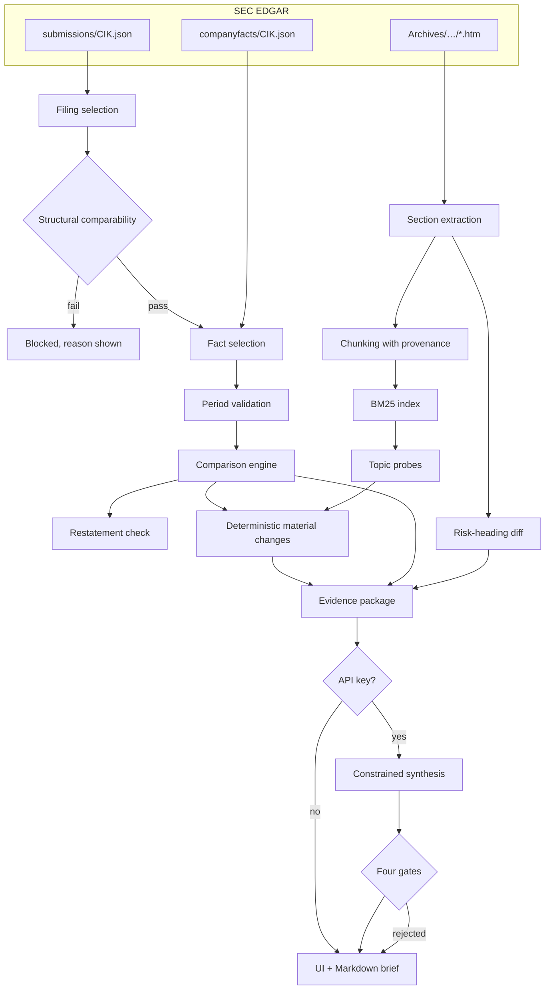

# Architecture

## Shape of the system

## Module map

| Module | Responsibility |
|---|---|
| `config.py` | Environment-driven settings; secrets never defaulted into source |
| `models.py` | Pydantic domain schemas — the contract between every layer |
| `formatting.py` | Display formatting only; never changes a value |
| `pipeline.py` | Orchestration. `run_analysis` is fully deterministic; `apply_ai_synthesis` is a separate, optional second pass |
| `sec/client.py` | Identified, throttled, cached EDGAR client with bounded retries |
| `sec/filings.py` | Filing discovery, amendment handling, structural comparability |
| `sec/facts.py` | XBRL parsing and transparent fact selection |
| `sec/sections.py` | HTML → text → named sections; bold-run risk headings |
| `analytics/period_matching.py` | Duration classification and fact-level compatibility |
| `analytics/metric_definitions.py` | The metric catalogue with ordered concept fallbacks |
| `analytics/comparisons.py` | **All displayed arithmetic**, plus restatement detection |
| `analytics/validation.py` | Numeric grounding, recommendation detection, injection redaction |
| `retrieval/chunking.py` | Section-aware chunks carrying full SEC provenance |
| `retrieval/index.py` | BM25 with metadata filters, phrase frequency, query coverage |
| `retrieval/search.py` | The topic catalogue, question routing, query expansion |
| `retrieval/citations.py` | Citation formatting and mechanical id validation |
| `research/change_detection.py` | Deterministic material changes and the risk diff |
| `research/prompts.py` | Prompt construction with untrusted-data framing |
| `research/synthesis.py` | Model interpretation behind four validation gates |
| `research/qa.py` | Question answering, decline gates, risk-question routing |
| `research/brief.py` | The nine-section Markdown brief |
| `services/cache.py` | SQLite-indexed content cache |
| `services/llm.py` | Structured-output client; degrades to a log, never raises |
| `ui/components.py` | Streamlit rendering helpers |

## Data flow in detail

### 1. Filing selection

`submissions/CIK##########.json` gives the recent filing index. Filings of the requested form are
collected newest-first; where an original and an amendment cover the same report date the original wins,
and the amendment is flagged. `check_comparability` then runs **before any numbers are touched**:

A 10-Q supports two comparisons that answer different questions, so the pair records which one it is
meant to be (`FilingPair.basis`) rather than inferring it from the gap:

| Basis | Pairs | Holds seasonality constant |
|---|---|---|
| `year_over_year` (default) | the same quarter a year earlier | yes |
| `sequential` | the immediately preceding quarter | no — every figure carries a caveat saying so |

A 10-K has only `year_over_year`, so the control is hidden for it. The checks are then:

* form base must match (a 10-K never meets a 10-Q),
* the later period must actually be later,
* the gap must match the basis: annual 10–14 months, quarterly exactly 12 year-over-year or 2–4
  sequential — and a refusal names the basis that *would* accept the pair,
* period-end months that differ raise a fiscal-calendar note, but only within two months of the
  year-over-year window; outside it the pair is simply the wrong one and the gap note already says so,
* an amendment on either side raises a note.

A failed check sets `comparability_ok = False`, which suppresses every metric comparison downstream and
puts a blocking banner in both the UI and the brief. Notes live on the pair and nowhere else — copying
them into `AnalysisResult.warnings` as well made every surface print each one twice.

The same basis reaches the *fact-level* check (`periods_compatible`), because "aligned" means different
things for the two: a Dec-to-Mar quarterly pair is ~275 days from being a year apart and exactly one
period apart. Measuring the wrong one blocked all 21 metrics on a pair the structural check had just
accepted. Balance-sheet facts state a date but no duration, so their expected spacing comes from the
comparison's reporting length; without it every instant metric dropped out of a sequential run.

Sequential year-to-date is refused outright: year-to-date accumulates from the fiscal year start, so
consecutive quarters cover six months and then nine and have nothing like-for-like to compare. The UI
disables the choice and the pipeline explains it rather than returning an empty grid.

### 2. Fact selection

`companyfacts/CIK##########.json` carries, for every fact, the accession number of the filing that
reported it. That is what makes provenance auditable, and it is why this client is hand-rolled.

Candidates are first narrowed to one **reporting length**. A period end date does not identify a
period on its own: a 10-Q tags the quarter *and* the year-to-date figure against the same end date, so
selecting on the end alone makes the two look like conflicting values for one period and the pick
between them falls out of parse order. `duration_class` (from `classify_duration`) resolves this.
It defaults to the form's usual length — `10-K` → `annual`, `10-Q` → `quarterly` — and the UI exposes
a Quarter / Year-to-date toggle for 10-Qs. If the requested length is not tagged, the metric is `N/A`;
a different length is never substituted.

Selection rules are then applied in order and recorded on the result:

1. `filing_scoped_exact_period` — same accession, period end equal to the filing's report date.
2. `filing_scoped_near_period` — same accession, period end within 10 days (52/53-week calendars).
3. `cross_filing_original_report` — earliest-filed fact for the period, i.e. as first published.
4. Otherwise the metric is `N/A` with the list of concepts tried.

Values that still disagree — same concept, same end, *same length* — raise a warning. The most recently
filed wins; when they share a filing date the warning says so rather than claiming a newer value
exists, and accession breaks the tie so the result never depends on parse order.

Both sides of a comparison always use the same length, and the basis is shown as a chip above the
figures so a year-to-date reading is never mistaken for a quarterly one. The chip is read back off the
facts that were selected, not off the requested setting, so it cannot claim a basis the numbers do not
have (`reported_basis`, in `analytics/period_matching.py`).

The basis also has to be stated where figures sit next to filing text, because a 10-Q's MD&A narrates
the quarter *and* the cumulative year to date while the grid shows one of them. On MSFT Q3 FY2026 the
grid reads cost of revenue +22.4% (the quarter) while the MD&A paragraph retrieved beside it says
"increased $13.0 billion or 20%" (the nine months). Both are the filing's own numbers, so any change
that pairs figures with excerpts carries a caveat naming which basis the figures are on.

Because selection is filing-scoped, the year-over-year comparison is the one an analyst would read off
the two documents. `detect_restatements` then re-reads the prior period *as re-tagged in the newer
filing* and flags any difference above 0.1%.

### 3. Period validation

Two layers. Structural checks live on the filing pair; fact-level checks run per metric in
`periods_compatible`, which rejects period-type mismatches, unit mismatches, duration-class mismatches,
durations differing by more than 45 days, and fiscal ends more than 45 days from being exactly N years
apart. Derived metrics resolve to their inputs, so `free_cash_flow` is only computed when both operating
cash flow and capex passed independently.

### 4. Metrics

21 metrics: 14 reported (ordered concept fallbacks, and total debt as a sum of tagged components) and 7
derived in Python. Level metrics get a percent change; ratio metrics get a percentage-**point** change and
never a percent. Zero denominators and sign flips suppress the percentage with an explicit warning
instead of printing a meaningless number.

### 5. Sections

Filing HTML is flattened to text with scripts, styles and markup discarded — filing content is untrusted
input and is never re-rendered as markup. Running page headers and page numbers are stripped.

Two things vary independently and are handled separately: **which items exist** (the form) and **how the
heading is marked up** (the filer).

**Which items exist.** Each form has its own outline in `sec/sections.py`, listing its items in document
order. The schemes are unrelated: MD&A is Item 7 in a 10-K and Item 2 in a 10-Q, a 10-Q's Item 1 is the
financial statements rather than the business description, and a 10-Q restarts numbering at Part II so
`Item 1` and `Item 2` each occur twice in one document. Anchors are therefore matched against the
outline *as a sequence* rather than looked up by item number — the second `Item 1` can only be Part II's,
because Part I's has already been claimed. Each outline entry carries the semantic `section_id` the
retrieval layer keys on (shared across forms, so one topic probe finds MD&A in either) and a
form-correct label, which is what every citation prints.

**How the heading is marked up.** Filers render the actual item headings in **upper case**
(`ITEM 1A. RISK FACTORS`) while the table of contents and running headers use title case (`Item 1A.`).
Matching only upper-case anchors removes almost all table-of-contents false positives; title-case and
bare-title fallbacks follow, each less precise than the last. A strategy is accepted only once it has
produced the form's load-bearing section in substance — Business, Risk Factors and MD&A for a 10-K, MD&A
alone for a 10-Q, since a 10-Q has no business description and its Item 1A is routinely one sentence
pointing back at the 10-K. Where every strategy fails the system reports low extraction confidence
rather than guessing.

Risk-factor headings come from bold/`font-weight:700` runs of 35–320 characters located inside the risk
span the same strategy and outline located — the structure filers actually mark up, and far more
reliable than inferring topic boundaries from prose.

### 6. Retrieval

Chunks are paragraph-grouped to ~1,100 characters, split on sentence boundaries when oversized, and carry
ticker, company, CIK, form, accession, filing date, report date, section id and label, heading, ordinal,
a content-hashed chunk id, and the SEC document URL.

BM25 (k1=1.5, b=0.75) with metadata filters on period and section. Deterministic tie-breaking on chunk id
means the same filing pair always produces the same evidence — which is what makes the demo and the
evaluation reproducible.

Two derived measures live on the index:

* `phrase_frequency` counts non-overlapping phrase occurrences, longest phrase first, so
  "artificial intelligence" is one mention rather than two and a list containing both `ai` and
  `generative ai` does not double-count.
* `query_coverage` returns the IDF-weighted share of a query's **content terms** present in the corpus.
  Terms absent entirely carry maximum IDF into the denominator. Question words ("describe", "drove") are
  dropped first — filings never contain them, and leaving them in made well-phrased questions look
  unanswerable.

### 7. Deterministic change detection

Ten fixed, versioned topics (capex, AI, competition, cloud demand, margin drivers, capacity constraints,
regulation, workforce, cybersecurity, shareholder returns). For each: retrieve top-k from both periods,
measure the emphasis delta, and pull in the linked metric comparisons.

A topic becomes a material change when its emphasis delta exceeds 1.5 mentions per 10,000 tokens **or** a
linked metric exceeds 15% (levels) / 1.0pp (ratios). Candidates are ranked by combined signal strength, a
single metric may anchor at most two claims, and the list is capped at eight. When the numbers and the
language point in opposite directions the change is classified `quantitative_shift` and described as a
divergence — that is usually the most interesting case.

Risk headings are diffed with `difflib` fuzzy matching at 0.72 similarity, so a reworded risk counts as
retained rather than as one addition plus one removal.

### 8. Constrained synthesis

Applied only after the deterministic result is complete. Four gates:

1. **Schema** — Pydantic validation inside `services/llm.py`; unknown fields ignored, invalid enums rejected.
2. **Citations** — every source id must resolve to a supplied chunk, and a cross-period claim must cite
   both periods.
3. **Numeric grounding** — every numeric literal in the generated prose must appear in the supplied
   evidence or the computed metric table, matched across scale and precision variants.
4. **Content** — recommendation language is rejected outright.

A change failing any gate is discarded and the deterministic change for that topic stands. Deterministic
entries for topics the model did not cover are always preserved, so a measured signal is never silently
lost. Refusals, timeouts, truncation and validation failures all resolve to "no parsed output" plus a run
log entry — the model layer cannot raise into the UI.

### 9. Output

Five views (selection, financial snapshot, material changes, filing Q&A, brief) and a nine-section
Markdown brief with a claim-type label on every line, provenance on every excerpt, the free-cash-flow
definition, standing caveats, and the model run log.

## Reproducibility

Same filing pair → same chunk ids, same evidence, same deterministic changes, same numbers. Guaranteed by
content-addressed caching, content-hashed chunk ids, deterministic BM25 tie-breaking and fixed topic
queries. There is a test asserting it (`test_analysis_is_reproducible`).
